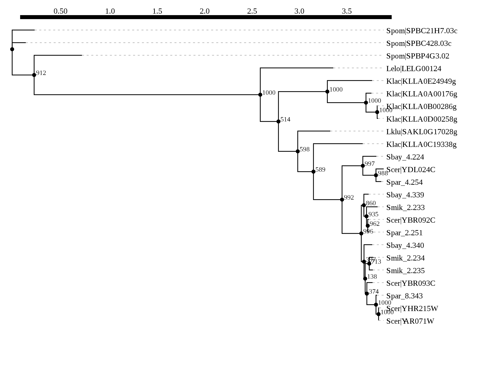
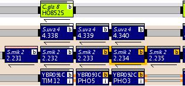
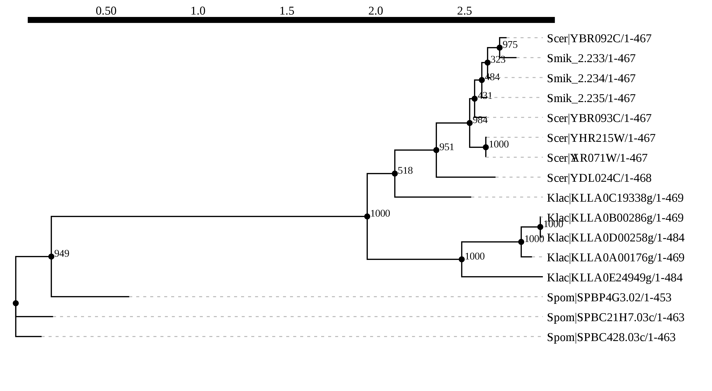
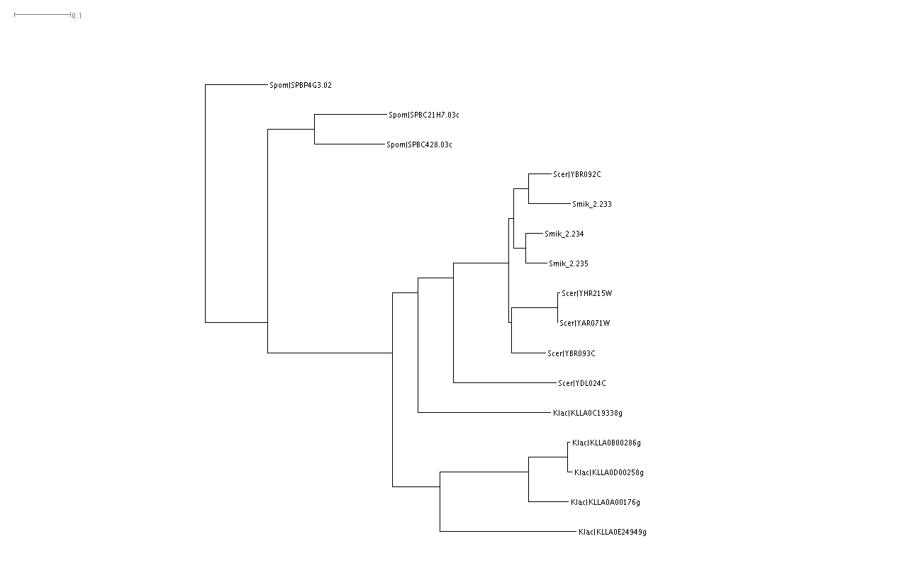

Goal
====

- Reconstruct the phylogeny for PHO5 family homologs in a set of species in order to test the hypothesis of repeated duplication of phosphatase-encoding genes.

Materials & Method
====

- species were chosen to include three that have multiple PHO5 family gene members, i.e. _S. pombe_ (3), _K. lactis_ (5) and _S. cerevisiae_ (5). 
- Three more species in the sensu stricto clade were added to assess how recently had some of the gene duplication occurred.
- Gene geneaologies were reconstructed using the PhyML online program. See notes below for detailed parameters used.

Notes
=====

## 4 septembre 2017

### Goal

- Revise the PhyML analysis by reconsidering what species to include and what to exclude

### Method

- Remove _L. kluyveri_ and _S. bayanus_

- Add _L. waltii_, which is positioned between _sensu stricto_ and _K. lactis_.

- Renamed sequence names to make the format more consistent.

- Repeated the Probcons (1000 iterations) alignment in Jalview and ALTER conversion into Phylip format. See [here](data)

- Submitted to [PhyML](http://www.atgc-montpellier.fr/phyml/), paramter: AIC for model selection / BioNJ for starting tree / SPR for tree improvement / aBayes for fast likelihood / 1000 bootstraps

### Result

- I eventually settled with just the four species with multiple _PHO5_ family members, and which have been experimentally tested in this study. These are _S. cerevisiae_, _S. mikatae_, _K. lactis_ and _S. pombe_. The resulting tree is easier to interpret.

- The new PhyML results were downloaded in the [results](result/tree) folder.
 
- I made some simple adjustments in the GUI available from the PhyML web service site, called PRESTO (a Phylogenetic tReE viSualisaTiOn), and exported the image in SVG format for further editing.

- In Inkscape, I extensively edited the tree by

    1. moving the bootstrap values to the left of the internal nodes

    1. added legend for the scale as "substitution per site"

    1. colored some of the internal nodes red as "inferred duplication event", requiring bootstrap support to be > 950/1000

    1. added an inset showing the species tree

    1. added gene common names for _S. cerevisiae_ and 2/3 _S. pombe_ genes

    1. color coded the 4 genes whose induction has been attributed experimentally to either thiamine or phosphate starvation (Figure 4).

    1. added a legend at the bottom to explain the colors.

- In Google Draw, I assembed the entire Figure 3

    1. start from a 8.5 x 11 letter size

    1. made two cartoon figures to illustrate the two scenarios, i.e. duplication first or speciation first.

    1. downloaded the figure as pdf / png.

## 11-12 juillet 2017

### Plan 

- Obtain _S. paradoxus_ and _S. bayanus var uvarium_ sequences using BLAST
- Add _L. kluyveri_ and ?, compile a new sequence file, repeat alignment and tree building procedures
- Incorporate syntenic information for the sensu stricto species
- Consider gene conversion (this is Alisa Sedghifar's suggestion) as a possible factor 
- Can I get a second most probably tree from PhyML or MrBayes?

### Result

#### Alignment and tree

1. Got the _S. paradoxus_ and _S. bayanus var uvarium_ sequences. See notes [here](data/BLAST/README.md)

1. Added _L. kluyveri_, _L. elongosporus_, both of which have only one copy.

1. Redid [alignment](data/alignment/Pho5_extended_MSAprobs_aln_20170712_01.fa) and submitted for PhyML analysis.

   - result is below
   

   - the tree supports four of the five Klac members to have been amplified post speciation between _K. lactis_ with either _L. kluyveri_ or the _sensu stricto_ species. there might have been an ancient duplication in the common ancestor of the three species. But the support is not great (node with support value of 514/1000)

   - the sequences within the _sensu stricto_ clade are quite close and not easy to resolve (shown as relatively low bootstrap values). there is some strong support for YHR215W (_PHO12_) and YAR071W (_PHO11_) being derived from a species specific duplicaiton event. the rest are less certain

#### Synteny

1. 

   - ScPho5 and ScPho3 are tandem, and they are syntenic with Smik_2.233, 2.234 and Suva_4.339, 4.340 (note that YGOB uses Suva to indicate _S. bayanus var uvarium_) while Smik_2.235 appears to be newly duplicated copy specific to _S. mikatae_. There are no syntenic orthologs in _K. lactis_ or other species.
   - All five _K. lactis_copies are on separate chromosomes, and no syntenic block in the _sensu stricto_

## 10 juillet 2017

### Alignment

1. Species (# of paralogs) used for alignment:

   - _S. cerevisiae_ (5), _S. mikatae_ (3), _K. lactis_ (5), _S. pombe_ (3)

1. Used JalView(2.10.1)-implemented ProbCons program, with **1000** passes of iterative refinement

   saved the result as fasta [link](data/alignment/PHO5_probcons_aln_20170710.fa)

1. Converted FASTA to PHYLIP using ALignment Transformation EnvRonment ([ALTER](http://sing.ei.uvigo.es/ALTER/))

   saved the result [here](data/alignment/PHO5_probcons_aln_20170710.phy)

### Tree construction

#### PhyML

[PhyML](http://www.atgc-montpellier.fr/phyml/) is a program that uses Maximum Likelihood method to do (substitution) model selection, and can do tree improvement using Subtree Pruning and Regrafting (SPR). It also does bootstrapping to provide support values.

- Test 1: AIC for selection criterion / BioNJ as start / SPR for tree improvement / 1000 bootstrap / default everywhere else

- Test 2: same as above except 100 bootstrap

- results downloaded as zip files in the [result/tree](result/tree) folder

- Here is a taste

    

#### SplitsTree

Downloaded and installed [SplitsTree](http://ab.inf.uni-tuebingen.de/data/software/splitstree4/download/welcome.html), to do phylogenetic analysis

- Opened the [fasta](data/alignment/PHO5_probcons_aln_20170710.fa) file and did a rudimentary BioNJ tree construction, then showed in phylogram with uncorrected P distance 

- Can already see that for most of the paralogs within a species, the first coalescent event is between paralogs rather than speciation, indicating that duplications happened after speciation.

### Sum-up

Based on what I got today, I can make the following inferences:

- all three _S. pombe_ phosphatases clearly amplified after the species has diverged from the rest examined here.

- Four of the five _K. lactis_ paralogs closely cluster with high bootstrap support, suggesting they originated after the species has diverged from the _sensu stricto_ group

- One _K. lactis_ gene is more similar to the _sensu stricto_ genes. One explanation is that there has been an ancient duplication event in the ancestor of _S. cerevisiae_ and _K. lactis_ -- the [PhylomeDB](https://goo.gl/ZsH8Ps) site made the same inference -- then one of the duplicated copies was lost in _S. cerevisiae_ and its close relatives but retained in _K. lactis_. 

- Similar inferences can be made about the _S. mikatae_ copies, which would involve a couple of gene loss and duplication events to best explain the tree. However, notice the less than perfect support value for those nodes, indicating that they may be too similar to draw a strong conclusion.

## 9 juillet 2017

### Planning for next step

#### Goal

Build gene trees and compare it to the species tree to infer the relative timing of duplication to that of speciation

#### Approach

1. Compile a new list of sequences

   - _S. cerevisiae_, _S. mikatae_, _S. paradoxus_, _C. glabrata_, _K. lactis_, _A. gossypii_, _S. pombe_

1. Construct gene trees

   - Try JalView first. Need to use bootstrap. Compare the resulting tree with PhylomeDB

1. Interpret results

## 7-8 juillet 2017 

### Sequence retrieval and alignment

#### Email discussion with Dennis to clarify (limit) the scope of the analysis

> Totally reasonable questions. I think we can simplify the analyses down to PHO5 because PMU only expanded in the CTG clade. I would just go with the PHO genes in those species you highlighted below (S. mikatae, S. cerevisiae, C. glabrata, and K. lactis, A. gossypii and S. pombe). Sorry about that. I am guessing we want to put in all the paralogs from those species, but only highlight the genes we have analyzed (i.e. PHO3, PHO5). Our problem is that we don’t really know the differences between PHO11 and PHO5. I am guessing we will probably want a cutoff ~50% identity to have the paralogs and it is possible that some of the Kl and Sc genes that are phosphatases may be so different that they don’t align well.

As a result, I updated the goal of my analysis as follows:

* Species: S. mikatae, S. cerevisiae, C. glabrata, and K. lactis, A. gossypii and S. pombe
* Gene family: Pho5
* Analysis: find all orthologs and paralogs of Pho5 in the above species, build gene trees and compare them to the species trees to infer the evolutionary history of the gene family relative to the speciation events

#### Renewed effort to retrieve sequences

* With a new focus on the 6 species, I quickly determined that two of them, namely _C. glabrata_ and _A. gossypii_ don't contain any orthologs of Pho5

* For _S. pombe_ and _K. lactis_, I cross-referenced the HMMER-EBI web service result, the Regev/Wapinski Orthogroup, and also checked individual gene name and sequence in KEGG genome sequences for _K. lactis_. I determined that _K. lactis_ genome contains 5 paralogs orthologous to ScPho5, while _S. pombe_ contains three. 

* Checking [PhylomeDB.org](phylomedb.org) revealed something interesting: for the 5 members of Pho5 family in _K. lactis_, one of them, named KLLA0C19338g, is the most close relative to all 5 of the Pho5 family members in _S. cerevisiae_, while the remaining four _K. lactis_ genes are about equal distance (sequence space) to their _S. cerevisiae_ relatives. PhylomeDB thus infers that most of the gene duplication events have occurred after the speciation points. 

* Efforts to identify homologs in _S. mikatae_ encountered some technical challenges. NCBI Blast doesn't seem to find anything when I restrict the search to _S. mikatae_ (organism). The [Sensu Stricto Genome Resources](http://www.saccharomycessensustricto.org) website doesn't provide BLAST function. The HMMER-EBI web service is connected to the Ensembl database, which doesn't include this species. The SGD "Fungal Blast" function is down at the moment. Left with no better choices, I decided to set up BLAST and do a search locally. To do so,

   1. I found that Havard RC already has BLAST (2.9) installed as a module. So I simply did this excercise on their server. `module load blast/2.2.29+-fasrc01`
	
   1. I downloaded the annotated FASTA file from the [Sensu Stricto Genome Resources](http://www.saccharomycessensustricto.org) (hereinafter referred to as SSGR) website and used `makeblastdb -in Smik.fsa -parse_seqids -dbtype nucl` to turn the FASTA file into a BLAST database.

   1. I then performed the search using `tblastn -query Pho5.fa -db Smik.fsa -out test` to execute the search.

   1. Cross-referencing the hits with [YGOB](http://ygob.ucd.ie/), I found the gene IDs are not really matching.

* To find out why _S. mikatae_ gene IDs used in the SSGR doesn't match other websites, I attempted to figure out which version of sequence did each site uses.

   * There are two versions of the genome. The older one is produced by Manolis Kellis, Eric Lander et al. (2003), and the newer version by Devin Scannell, Chris Hittinger et al. (2011).

   * Strangely, the newer version has not been adopted by [SGD](http://www.yeastgenome.org)

   * According to its website, the latest (v7, 2012) of [YGOB](http://ygob.ucd.ie/) has updated its database to the newer Scannell data. It's strange then why the IDs don't match. 

* I now solved the _S. mikatae_ issue. See [here](data/Blast_Pho5_Smik/README.md) for detail. Briefly, I found three tandem duplicates that are highly similar (~80% id) to ScPho5, on Smik_2 (ultra-scaffold 2).

## 6 juillet 2017

### Sequence retrieval and alignment

#### What I did in 2016 September

I found last time I used the Regev/Wapinsky Orthogroup data, rather than performing blast myself. This greatly eased the first step of sequence retrievement. However, there might be caveats. For example, no Pho5 orthologs can be detected in the _K. lactis_ genome, and yet plate assay clearly supports the presence of a secreted acid phosphatase. 

#### New effort

##### HMMER + EMBL Genome

* Software: [HMMER v3.1](http://www.ebi.ac.uk/Tools/hmmer/about)

* Seq bait: S. cerevisiae YBR093C (PHO5)

* Results: 5 different genes with distinct genomic locations and sequence similarity with Pho5 in the range of 62%-75%

