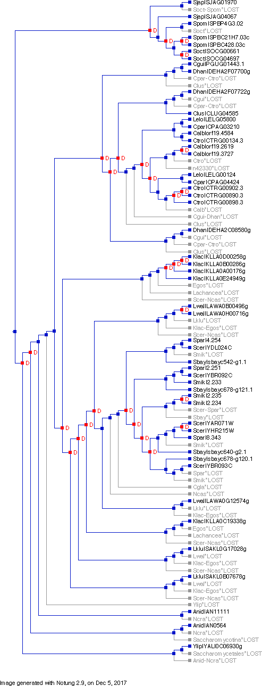
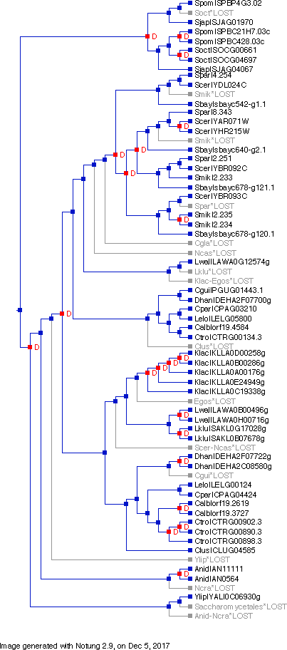

## Goal

Reconcile gene tree with species tree to infer duplication and loss events

## Background

After [talking to Josh](/docs/2017-11-18-discuss-with-josh-on-phosphatase-duplication.md), I came to realize that gene family amplification and contraction didn't just happen at the tips (recent evolutionary history), but has always been going on. This dynamic process produces the complex pattern in the gene tree, which confused me in the first place, and is part of the reason why I decided to present the results for just four species -- chosen so that the gene tree looks "clean". Instead of manually inferring the evolutionary history, a much better and consistent way is to use a formal reconciliation algorithm, such as Notung.

## Notes

### [22 nov 2017] Install Notung 2.9 and format gene tree to annotate species names

- Installed Notung 2.9 as instructed by the [website](http://goby.compbio.cs.cmu.edu/Notung/download29.html#)
- Created a text file to list all 16 species in the Orthogroup [link](/data/tree/Orthogroup_species.txt)
- Used [NCBI Taxonomy tool](https://www.ncbi.nlm.nih.gov/Taxonomy/CommonTree/wwwcmt.cgi) to import the file above and save the tree as phylip
- Substantially edited the tree based on [Shen et al 2016](http://www.g3journal.org/content/6/12/3927) phylogeny.
- Also shortened the species names to match the notation used in the gene tree (e.g. Scer) and flipped the order.
- Imported both the [gene tree](/output/notung/pho5_ascomycetes_tree_20171115.txt) and the [species tree](/output/notung/species_tree_reordered_20171122.phy) in Notung and performed reconciliation
- The result is below
    
- I am still learning Notung's functionality. I found "Rooting analysis" and "Rearrangement", both of which are based on the idea of minimizing the total DL score (# of duplication/loss events), are potentially useful. I need to read the manual more carefully and test them.

### [5 dec 2017] Species tree inconsistency and more Notung dives

1. Species tree

    - I found that the phylogenetic relationship for a couple of species, including the two Lanchancea ones, _E. gosypii_ and _K. lactis_ differs between different phylogenetic papers. Notably, [Hittinger _et al._ 2015](https://www.ncbi.nlm.nih.gov/pmc/articles/PMC4771062/) and [Shen _et al._ 2016](http://www.g3journal.org/content/6/12/3927), both with Chris Hittinger in the author list, suggest the following arrangement: (((L. waltii, L. kluyveri), (E. gossypii, K. lactis), (N. castellii, (C. glabrata, S. cerevisiae))).
    - Other papers, such as [Dujon 2010](http://www.nature.com/nrg/journal/v11/n7/full/nrg2811.html), [Suh _et al._ 2006](http://www.mycologia.org/content/98/6/1006) and [Kultzman 2003](http://onlinelibrary.wiley.com/doi/10.1016/S1567-1356(03)00175-2/abstract) all support the following arrangement: (E. gossypii, (K. lactis, ((L. waltii, L. kluyveri), (C. glabrata, S.cerevisiae))))
    - In my analysis, I used the former arrangement. But I intend to investigate how a different species tree can influence the result of reconciliation.

1. More on Notung

    - Edge weights:

        In gene trees, this can indicate confidence of branching, based on bootstrap values for example. In species trees, if edge weights are present, they will be displayed, but will be ignored during the event inference procedure.  

    - Rooting: 

        this function actually first calls Reconciliation, after which it shows the recommended rooting branches based on the event score (less is better). In my case, there is one branch with the strongest support. It separates the fission yeast clade from the rest of the species, which suggests that the all duplication events within this dataset happened after the divergence of the fission yeast from the remaining species.

    - Rearranging:

	according to the manual, this function is designed to "rearrange weakly supported regions in a gene tree to produce alternate event histories with minimum DL Score". Here is my understanding of what it does: First, the program determines a series of branches (edges) as weakly supported, based on the "Edge Weight Threshold", which is set to 90% of the maximum by default. Next, it explores alternative event histories by allowing those weakly supported edges to be rearranged among themselves, while keeping the strongly-supported edges in place. This produces the rearranged tree with an event score smaller than the beginning value. 

	using the default threshold for rearrangement, I got a rearranged tree with a dramatically lower event score -- 21 dups and 16 losses compared to 29 dups and 45 losses before the procedure. The resulting tree now places all 5 Klac genes together, suggesting that all duplication events happened post speciation for _K. lactis_. Below are the results before and after the rearrangement.

	Before             |  After
	:-----------------:|:-------------------------:
	  |  

