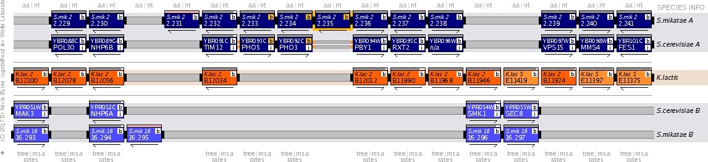
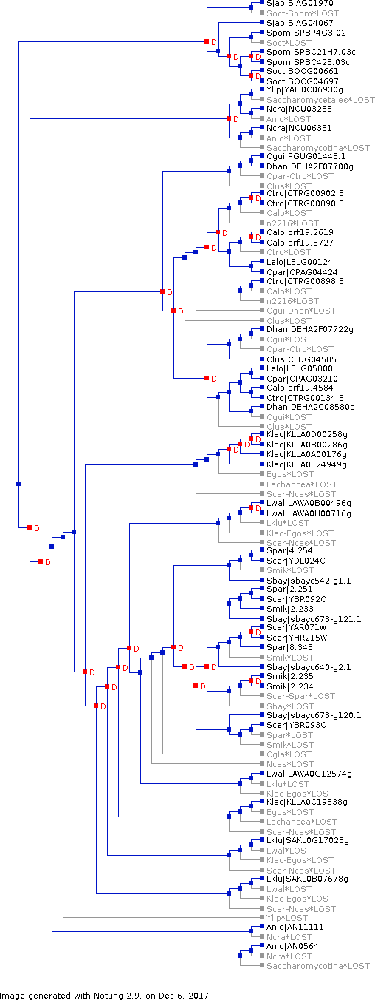
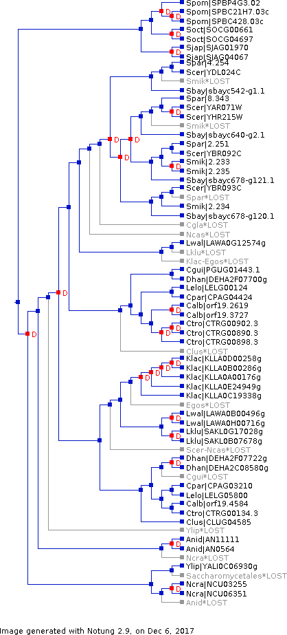

## Motivation

A gene tree for _PHO5_ family members in 23 species of Ascomycete yeast shows [complicated pattern](../output/notung/pho5_ascomycetes_tree_20171115.txt). Specifically, the gene tree cannot be conformed to the species tree by only invoking **recent duplication events**. Rather, ancient duplication and subsequent loss events appear to be a salient feature of this gene family's evolutionary history. To formally "reconcile" the gene tree with the species tree, we used [Notung 2.9](http://www.cs.cmu.edu/~durand/Notung/) to infer Duplication-Loss events. The goal of the algorithm is to search for an "event history" that minimizes the total "event score", which is defined as a weighted sum of the number of duplication and loss events.

## Supplementary materials and methods

### Identify and retrieve _PHO5_ homologs in 23 Ascomycete yeasts

We downloaded _PHO5_ homologs in 23 Ascomycete species from the Fungal Orthogroup Repository (https://portals.broadinstitute.org/regev/orthogroups/) (Wapinski _et al._ 2007 Nature). These species represent all major clades of the Ascomycetes phylum, including the _Saccharomycotina_ (budding yeast), _Pezizomycotina_ (filamentous fungi) and _Schizosaccharomycetes_ (fission yeast), although sampling is strongly biased towards the first group, with the latter two being represented by just two and three species respectively. To identify any homologs missing from the Fungal Orthogroup Repository, we performed BLAST searches on the following online databases: Saccharomyces Genome Database (https://www.yeastgenome.org), Candida Genome Database (http://www.candidagenome.org), Genome Resources for Yeast Chromosomes (http://gryc.inra.fr/). In addition, we used HMMER webserver (https://www.ebi.ac.uk/Tools/hmmer/) (Finn _et al_ 2015 NAR) to search against the Reference Proteomes to leverage the high sensitivity of the HMM-based tool for identifying distant homologs. In total, we identified 53 putative _PHO5_ homologs in the 23 species. The number of homologs per species ranges between zero (_C. glabrata_, _N. castellii_ and _E. gossypii_) to five (_K. lactis_ and _S. cerevisiae_), with a median of 2 and a mean of 2.3 per species2 and a mean of 2.3 per species.

### Sequence alignment and phylogeny reconstruction for _PHO5_ family genes

We then aligned the amino acid sequences with ProbCons (Do _et al_ 2005 GR) with the following parameters: 2 consistency reps, 1000 iterative refinement reps, 0 pre-training reps. We submitted the aligned sequences to the PhyML web-server (v3.0 http://www.atgc-montpellier.fr/phyml/ Guindon et al. 2010) for phylogenetic reconstruction. The same parameters were used as in the methods in the main text except 100 bootstraps were performed instead of 1000 due to the much larger sample size.

### Gene tree and species tree reconciliation

We loaded both the gene tree from the last step and a species tree into Notung (v2.9 Durand, Halldorsson and Vernot 2006 J Comput Biol.). We used a species tree from (Shen et al. 2016 G3), which is based on 1233-gene data matrix. Reconciliation is performed following Notung's manual. Briefly, after both trees were loaded into the software, reconciliation is performed with the default weight settings. The gene tree is then rooted using the Rooting function in the software, which suggests the root branch that minimizes total event scores. This results in a gene tree that is congruent with the species tree, with the most ancient duplication events occurring after the fission yeast diverged from the others. Finally, the gene tree is "rearranged" using the Rearrangement function, which explores alternative tree topology by swapping weakly supported branches and looks for the topology that minimizes the total event scores. We followed the software's defaut setting, which defines weakly supported branches as those with less than 90/100 bootstrap values. This reduced the total number of duplications and losses from 29/48 to 23/15. Supplementary figure 1 shows the reconciled and rearranged gene tree with inferred duplication and loss events. The Notung annotated trees both before and after rearrangement are provided as supplementary data.

### Supplementary files and figures

[**Supplementary file 1**](./supplementary/Supplementary_file_1_alignment.phy). Multiple alignment of 53 _PHO5_ homologs from 23 Ascomycete yeast species.

[**Supplementary file 2**](./supplementary/Supplementary_file_2_ML_gene_tree.txt). Maximum likelihood gene (protein) tree for the 53 _PHO5_ homolog sequences.

[**Supplementary file 3**](./supplementary/Supplementary_file_3_notung_without_rearrangement.ntg). Reconciled gene tree with duplication and loss events marked, without rearrangement.

[**Supplementary file 4**](./supplementary/Supplementary_file_4_notung_with_rearrangement.ntg). Reconciled gene tree with duplication and loss events marked, after rearrangement with default edge weight threshold (90.0)

**Supplementary figure 1**  Syntenic relationship between _PHO5_ homologs in _S. cerevisiae_ and _S. mikatae_. Rows in the figure represent chromosomes and boxes represent genes. Genes are aligned in columns based on inferred syntenic relationship between species, where missing boxes indicate no syntenic homolog detected. _S. cerevisiae_ and _S. mikatae_ belong to a group of species whose common ancestor has experienced a whole-genome-duplication (WGD). Therefore, each species has two sets of chromosomes (A vs B) that correspond to a single set of ancestral chromosomes. _K. lactis_, as a pre-WGD species, represents the ancestral state. Other features in this figure are explained in detail on the Yeast Gene Order Browser help page (http://ygob.ucd.ie/), from which this screenshot was taken on Oct 7, 2017 [34]. This plot shows that the three _PHO5_ homologs in _S. mikatae_ form a single cluster, suggesting a possible origination through tandem duplication. The syntenic region in _S. cerevisiae_ contains just two genes, _ScPHO5_ and _ScPHO3_, which are also arranged in tandem. Note that _S. mikatae_ likely experienced an additional duplication event as indicated by the yellow box around 2.235. The other three _PHO5_ homologs in _S. cerevisiae_ are on different chromosomes. We also looked at _K. lactis_ and found that none of its five _PHO5_ homologs are syntenic with those in _S. cerevisiae_ or _S. mikatae_. The distantly related _S. pombe_ is not included in YGOB.

**Supplementary figure 2** Reconciled gene tree for the _PHO5_ family showing inferred duplication and loss events. (A) Reconciled tree without rearrangement. Inferred duplication events are marked with "D" in red font. Loss events are shown in gray. Species and gene names are labeled at the leaf nodes, separated by "|". (B) Reconciled and rearranged gene tree. During the rearrangement operation, Notung (v2.9) explores alternative topologies by swapping weakly supported branches with bootstrap values below 90/100 in the reconstructed gene tree. The result is a topology that minimizes the total event score (23/15 duplication/loss events compared to 29/48 before rearrangement).

