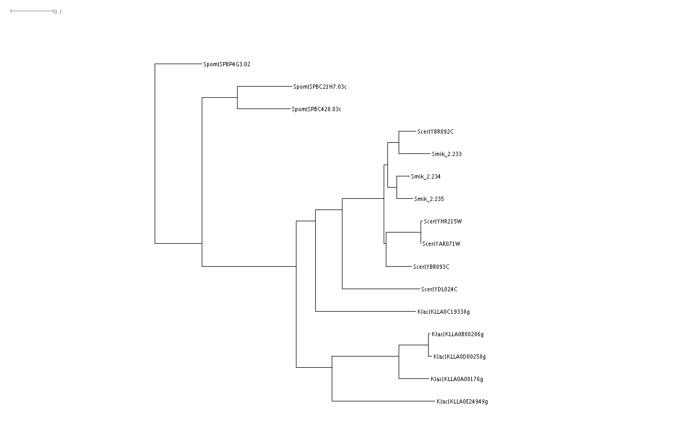

Notes
=====

## 10 juillet 2017

### Alignment and tree construction

1. Species (# of paralogs) used for alignment:

   - _S. cerevisiae_ (5), _S. mikatae_ (3), _K. lactis_ (5), _S. pombe_ (3)

1. Used JalView(2.10.1)-implemented ProbCons program, with **1000** passes of iterative refinement

   saved the result as fasta [link](result/alignment/PHO5_probcons_aln_20170710.fa)

1. Converted FASTA to PHYLIP using ALignment Transformation EnvRonment ([ALTER](http://sing.ei.uvigo.es/ALTER/))

   saved the result [here](result/alignment/PHO5_probcons_aln_20170710.phy)

1. Tested [PhyML](http://www.atgc-montpellier.fr/phyml/)

   - Test 1: AIC for selection criterion / BioNJ as start / SPR for tree improvement / 1000 bootstrap / default everywhere else
   - Test 2: same as above except 100 bootstrap
   - results link available through email

1. Downloaded and installed [SplitsTree](http://ab.inf.uni-tuebingen.de/data/software/splitstree4/download/welcome.html), to do phylogenetic analysis

   - Opened the [fasta](result/alignment/PHO5_probcons_aln_20170710.fa) file and did a rudimentary BioNJ tree construction, then showed in phylogram with uncorrected P distance 
   - Can already see that for most of the paralogs within a species, the first coalescent event is between paralogs rather than speciation, indicating that duplications happened after speciation.

## 9 juillet 2017

### Planning for next step

#### Goal

Build gene trees and compare it to the species tree to infer the relative timing of duplication to that of speciation

#### Approach

1. Compile a new list of sequences

   - _S. cerevisiae_, _S. mikatae_, _S. paradoxus_, _C. glabrata_, _K. lactis_, _A. gossypii_, _S. pombe_

1. Construct gene trees

   - Try JalView first. Need to use bootstrap. Compare the resulting tree with PhylomeDB

1. Interpret results

## 7-8 juillet 2017 

### Sequence retrieval and alignment

#### Email discussion with Dennis to clarify (limit) the scope of the analysis

> Totally reasonable questions. I think we can simplify the analyses down to PHO5 because PMU only expanded in the CTG clade. I would just go with the PHO genes in those species you highlighted below (S. mikatae, S. cerevisiae, C. glabrata, and K. lactis, A. gossypii and S. pombe). Sorry about that. I am guessing we want to put in all the paralogs from those species, but only highlight the genes we have analyzed (i.e. PHO3, PHO5). Our problem is that we don’t really know the differences between PHO11 and PHO5. I am guessing we will probably want a cutoff ~50% identity to have the paralogs and it is possible that some of the Kl and Sc genes that are phosphatases may be so different that they don’t align well.

As a result, I updated the goal of my analysis as follows:

* Species: S. mikatae, S. cerevisiae, C. glabrata, and K. lactis, A. gossypii and S. pombe
* Gene family: Pho5
* Analysis: find all orthologs and paralogs of Pho5 in the above species, build gene trees and compare them to the species trees to infer the evolutionary history of the gene family relative to the speciation events

#### Renewed effort to retrieve sequences

* With a new focus on the 6 species, I quickly determined that two of them, namely _C. glabrata_ and _A. gossypii_ don't contain any orthologs of Pho5

* For _S. pombe_ and _K. lactis_, I cross-referenced the HMMER-EBI web service result, the Regev/Wapinski Orthogroup, and also checked individual gene name and sequence in KEGG genome sequences for _K. lactis_. I determined that _K. lactis_ genome contains 5 paralogs orthologous to ScPho5, while _S. pombe_ contains three. 

* Checking [PhylomeDB.org](phylomedb.org) revealed something interesting: for the 5 members of Pho5 family in _K. lactis_, one of them, named KLLA0C19338g, is the most close relative to all 5 of the Pho5 family members in _S. cerevisiae_, while the remaining four _K. lactis_ genes are about equal distance (sequence space) to their _S. cerevisiae_ relatives. PhylomeDB thus infers that most of the gene duplication events have occurred after the speciation points. 

* Efforts to identify homologs in _S. mikatae_ encountered some technical challenges. NCBI Blast doesn't seem to find anything when I restrict the search to _S. mikatae_ (organism). The [Sensu Stricto Genome Resources](http://www.saccharomycessensustricto.org) website doesn't provide BLAST function. The HMMER-EBI web service is connected to the Ensembl database, which doesn't include this species. The SGD "Fungal Blast" function is down at the moment. Left with no better choices, I decided to set up BLAST and do a search locally. To do so,

   1. I found that Havard RC already has BLAST (2.9) installed as a module. So I simply did this excercise on their server. `module load blast/2.2.29+-fasrc01`
	
   1. I downloaded the annotated FASTA file from the [Sensu Stricto Genome Resources](http://www.saccharomycessensustricto.org) (hereinafter referred to as SSGR) website and used `makeblastdb -in Smik.fsa -parse_seqids -dbtype nucl` to turn the FASTA file into a BLAST database.

   1. I then performed the search using `tblastn -query Pho5.fa -db Smik.fsa -out test` to execute the search.

   1. Cross-referencing the hits with [YGOB](http://ygob.ucd.ie/), I found the gene IDs are not really matching.

* To find out why _S. mikatae_ gene IDs used in the SSGR doesn't match other websites, I attempted to figure out which version of sequence did each site uses.

   * There are two versions of the genome. The older one is produced by Manolis Kellis, Eric Lander et al. (2003), and the newer version by Devin Scannell, Chris Hittinger et al. (2011).

   * Strangely, the newer version has not been adopted by [SGD](http://www.yeastgenome.org)

   * According to its website, the latest (v7, 2012) of [YGOB](http://ygob.ucd.ie/) has updated its database to the newer Scannell data. It's strange then why the IDs don't match. 

* I now solved the _S. mikatae_ issue. See [here](data/Blast_Pho5_Smik/README.md) for detail. Briefly, I found three tandem duplicates that are highly similar (~80% id) to ScPho5, on Smik_2 (ultra-scaffold 2).

## 6 juillet 2017

### Sequence retrieval and alignment

#### What I did in 2016 September

I found last time I used the Regev/Wapinsky Orthogroup data, rather than performing blast myself. This greatly eased the first step of sequence retrievement. However, there might be caveats. For example, no Pho5 orthologs can be detected in the _K. lactis_ genome, and yet plate assay clearly supports the presence of a secreted acid phosphatase. 

#### New effort

##### HMMER + EMBL Genome

* Software: [HMMER v3.1](http://www.ebi.ac.uk/Tools/hmmer/about)

* Seq bait: S. cerevisiae YBR093C (PHO5)

* Results: 5 different genes with distinct genomic locations and sequence similarity with Pho5 in the range of 62%-75%

